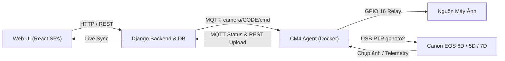

# HƯỚNG DẪN TÍCH HỢP & ĐIỀU KHIỂN MÁY ẢNH CANON EOS (6D / 5D / 7D)
**Hệ Thống Tự Động Hóa AutoTimelapse Cloud — CM4 Camera Agent**

---

## 📌 1. TỔNG QUAN KIẾN TRÚC ĐỒNG BỘ
Toàn bộ luồng điều khiển được đồng bộ khép kín **3 tầng**:


---

## ⚙️ 2. CẤU HÌNH PHẦN CỨNG CANON 6D TRÊN THỰC ĐỊA

| Mục | Yêu Cầu Cài Đặt | Lý Do Kỹ Thuật |
| :--- | :--- | :--- |
| **Công Tắc Nguồn** | **ON** liên tục | CM4 sẽ ngắt/bật điện qua Rơ-le GPIO 16 |
| **Bánh Xe Chế Độ (Mode Dial)** | **M (Manual Mode)** | Bắt buộc để CM4 toàn quyền chỉnh cả ISO, Khẩu độ, Tốc độ |
| **Cáp Kết Nối** | Mini-USB to USB-A | Cắm trực tiếp cổng USB CM4 |
| **Auto Power Off** | **TẮT (`0` hoặc `Off`)** | Tự động xử lý qua code để tránh máy tự ngủ giữa chu kỳ |
| **Drive Mode** | **Single Shot** | Tránh chụp liên thanh gây tràn bộ đệm và hao pin |
| **Thẻ Nhớ SD** | Đã Format trong máy | Lưu trữ dự phòng khi offline |

---

## 📋 3. BẢNG MAPPING WIDGET GPHOTO2 (CANON PTP)

| Thông Số | Candidate Widgets trong Code | Tùy Chọn Khả Dụng (Choices) | Mặc Định Khuyến Nghị |
| :--- | :--- | :--- | :--- |
| **ISO** | `iso`, `eos-iso` | `Auto`, `100`, `125`, `160`, `200`, `250`, `320`, `400`, `500`, `640`, `800`, `1000`, `1250`, `1600`, `2000`, `2500`, `3200`, `4000`, `5000`, `6400`, `12800`, `25600` | `100` (Ngày) / `1600` (Đêm) |
| **Shutter Speed** | `shutterspeed`, `eos-shutterspeed` | `1/4000`, `1/3200`, `1/2000`, `1/1000`, `1/500`, `1/250`, `1/125`, `1/60`, `1/30`, `1/15`, `1/8`, `1/4`, `0.5`, `1`, `2`, `4`, `8`, `15`, `30`, `Bulb` | `1/250` (Ngày) / `2s` (Đêm) |
| **Aperture** | `aperture`, `aperturevalue`, `f-number` | `f/1.4`, `f/1.8`, `f/2.8`, `f/4`, `f/5.6`, `f/8`, `f/11`, `f/16`, `f/22` *(phụ thuộc lens)* | `f/8` |
| **White Balance** | `whitebalance`, `eos-whitebalance` | `Auto`, `Daylight`, `Shade`, `Cloudy`, `Tungsten`, `White Fluorescent`, `Flash`, `Custom`, `Color Temperature` | `Daylight` |
| **Image Format** | `imageformat`, `imagequality` | `Large Fine JPEG`, `Large Normal JPEG`, `Medium Fine JPEG`, `Small Fine JPEG`, `RAW`, `RAW + Large Fine JPEG` | `Large Fine JPEG` |
| **Auto Power Off** | `autopoweroff`, `eosautopoweroff` | `0`, `Off`, `1 min`, `2 min`, `4 min`, `8 min`, `15 min`, `30 min` | **`0` (Luôn Bật)** |
| **Drive Mode** | `drivemode` | `Single`, `Continuous high`, `Continuous low`, `Silent single`, `10 sec self-timer`, `2 sec self-timer` | **`Single`** |
| **Mirror Lock** | `mirrorlock`, `eosmirrorlock` | `0`, `Off`, `Disable`, `1`, `On`, `Enable` | **`Off`** |
| **Capture Target** | `capturetarget` | `Memory card`, `Internal RAM` | `Memory card` |
| **Metering Mode** | `meteringmode`, `eos-meteringmode` | `Evaluative`, `Partial`, `Spot`, `Center-weighted average` | `Evaluative` |
| **Battery Level** | `eosbatterylevel`, `batterylevel` | Đọc mức pin thực tế `%` từ chip máy ảnh | Read-only |

---

## 🎯 4. CÁC BỘ PROFILE MẪU CHO TIMELAPSE CÔNG TRÌNH

### Profile 1: Ban Ngày Tiêu Chuẩn (Daytime Construction)
```json
{
  "iso": "100",
  "aperture": "f/8",
  "shutter_speed": "1/250",
  "white_balance": "Daylight",
  "image_format": "Large Fine JPEG",
  "drivemode": "Single",
  "mirror_lockup": "Off",
  "auto_power_off": "0",
  "capture_target": "Memory card",
  "metering_mode": "Evaluative"
}
```

### Profile 2: Ban Đêm & Thi Công Đèn Chiếu (Night Time)
```json
{
  "iso": "1600",
  "aperture": "f/4",
  "shutter_speed": "2",
  "white_balance": "Tungsten",
  "image_format": "Large Fine JPEG",
  "drivemode": "Single",
  "mirror_lockup": "Off",
  "auto_power_off": "0",
  "capture_target": "Memory card"
}
```

### Profile 3: Bình Minh & Hoàng Hôn (Golden Hour / Sunset)
```json
{
  "iso": "400",
  "aperture": "f/5.6",
  "shutter_speed": "1/60",
  "white_balance": "Cloudy",
  "image_format": "Large Fine JPEG",
  "drivemode": "Single",
  "mirror_lockup": "Off",
  "auto_power_off": "0",
  "capture_target": "Memory card"
}
```

---

## 📡 5. GIAO THỨC ĐIỀU KHIỂN MQTT (DEVICE API)

### 1. Lấy thông số hiện tại (`get_settings`)
- **Topic gửi**: `camera/{CAMERA_CODE}/cmd`
- **Payload**:
```json
{
  "command": "get_settings",
  "request_id": "req-get-001"
}
```
- **CM4 phản hồi qua Topic `camera/{CAMERA_CODE}/ack`**:
```json
{
  "type": "get_settings",
  "request_id": "req-get-001",
  "status": "ok",
  "data": {
    "online": true,
    "applied": {
      "iso": "100",
      "aperture": "f/8",
      "shutter_speed": "1/250",
      "white_balance": "Daylight",
      "drivemode": "Single",
      "auto_power_off": "0"
    },
    "capabilities": {
      "iso": {
        "current": "100",
        "choices": ["100", "200", "400", "800", "1600", "3200", "6400"],
        "writable": true,
        "widget_name": "iso"
      }
    }
  }
}
```

### 2. Gửi cài đặt thông số mới (`set_settings`)
- **Topic gửi**: `camera/{CAMERA_CODE}/cmd`
- **Payload**:
```json
{
  "command": "set_settings",
  "request_id": "req-set-002",
  "payload": {
    "iso": "200",
    "shutter_speed": "1/125",
    "white_balance": "Daylight",
    "drivemode": "Single",
    "auto_power_off": "0"
  }
}
```

### 3. Lệnh Chụp Ngay (`capture_now`)
- **Payload**:
```json
{
  "command": "capture_now",
  "request_id": "req-cap-003"
}
```

---

## 🧪 6. HƯỚNG DẪN TEST LOCAL TRÊN THIẾT BỊ CM4

Trên terminal SSH của CM4 (`autotimelapse@100.64.0.2`), chạy script test độc lập:

```bash
# Chạy trong container CM4 Camera Agent:
docker exec -it cm4_camera_agent python3 /app/src/test_canon_control.py

# Hoặc chạy trực tiếp trên host CM4:
python3 /home/autotimelapse/test_canon_control.py
```

### Kết quả đầu ra kiểm thử:
1. `[GPIO]` Tự kích hoạt nguồn Relay GPIO 16.
2. `[DETECT]` Nhận diện `Canon EOS 6D`, đọc Serial, Lens, Mức pin.
3. `[CHOICES]` Quét toàn bộ danh mục thông số khả dụng.
4. `[SET & VERIFY]` Tắt Auto Power Off, chuyển Single Shot, đổi ISO/Tốc/WB và đọc ngược lại từ máy để đối soát.
5. `[CAPTURE]` Bấm màn trập cơ học, tải file `TEST_*.JPG` về máy thành công.
